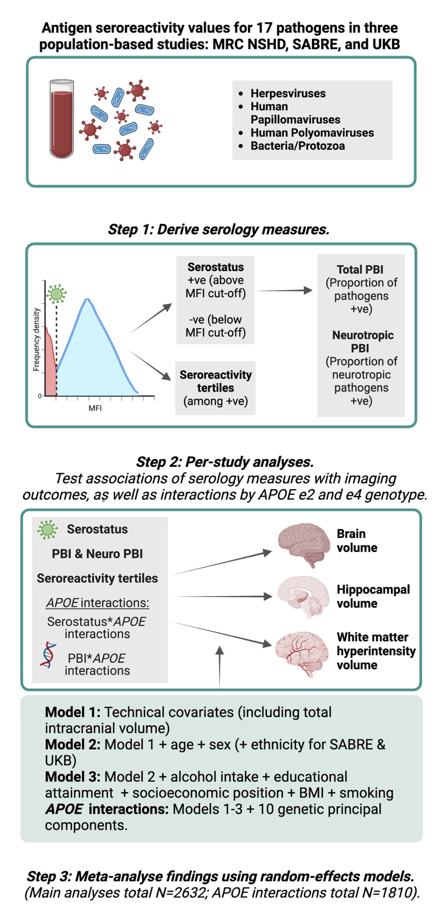

# [**Common infections and neuroimaging markers of dementia in three UK cohort studies**](https://doi.org/10.1101/2023.07.12.23292538)

_Rebecca E Green, Carole H Sudre, Charlotte Warren-Gash, Julia Butt, Tim Waterboer, Alun D Hughes, Jonathan M Schott, Marcus Richards, Nish Chaturvedi, Dylan M Williams_

---

## Background

This repo contains analysis code for the preprint [Common infections and neuroimaging markers of dementia in three UK cohort studies](https://doi.org/10.1101/2023.07.12.23292538) - _Green et al_ 2023. 

#### Repo structure:

```
.
├── README.md
├── scripts
│   ├── 1.analysis_nshd.R
│   ├── 1.analysis_sabre.R
│   ├── 1.analysis_ukb.R
│   ├── 2.analysis_main_ma.R
│   ├── 3.apoe_interactions_nshd.R
│   ├── 3.apoe_interactions_sabre.R
│   ├── 3.apoe_interactions_ukb.R
│   ├── 4.apoe_interactions_ma.R
│   ├── 5.apoe_stratified_nshd.R
│   ├── 5.apoe_stratified_sabre.R
│   ├── 5.apoe_stratified_ukb.R
│   ├── 6.apoe_stratified_ma.R
│   ├── 7.figure2.R
│   └── 8.figure3.R
├── docs
│   └── figure1.pdf - analysis workflow figure
└── LICENSE.md

```

--- 

### Project workflow

  
---
